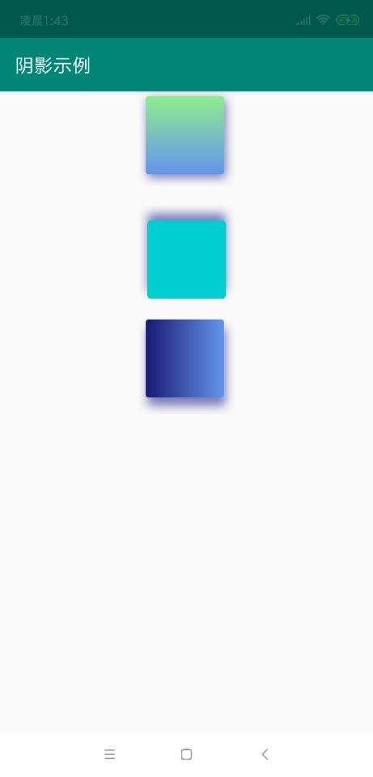

# DrawableWithShadow
一个可以实现阴影的drawable，兼容AndroidX

## 使用方法

1. 注意
  * 属性可以不用全设置。
  * 如果设置了LinearGradientConfig，那么DrawableBgColor将无效。
  * view在设置drawable时候，必须要执行`setLayerType(View.LAYER_TYPE_SOFTWARE, null)`,因为硬件加速的问题。
  * 这种方式的缺点是drawable占用位置的大小，需要提前预留出来大小

2. java

```
DrawableWithShadow buildThree = new DrawableWithShadow.Builder()
                .setShadowRadius(20)
                .setCornerRadius(6)
                .setDrawableBgColor(Color.RED)
                .setLinearGradientConfig(new LinearGradientConfig(colors, LinearGradientConfig.LinearGradientOriention.HORIZONTAL))
                .setShadowColor(SHADOW_COLOR)
                .setDx(5)
                .setDy(24).build();
        viewThree.setLayerType(View.LAYER_TYPE_SOFTWARE, null);
        ViewCompat.setBackground(viewThree, buildThree);
```
 
3. kotlin
 
 ```
  val buildOne = DrawableWithShadow.Builder()
                .setShadowColor(SHADOW_COLOR)
                .setLinearGradientConfig(LinearGradientConfig(colors1, LinearGradientConfig.LinearGradientOriention.VERTICAL))
                .setDx(5)
                .setDy(10).build()
        viewThree.setLayerType(View.LAYER_TYPE_SOFTWARE, null)
        ViewCompat.setBackground(viewThree, buildOne)
 ```


 ## 示例
 
 
